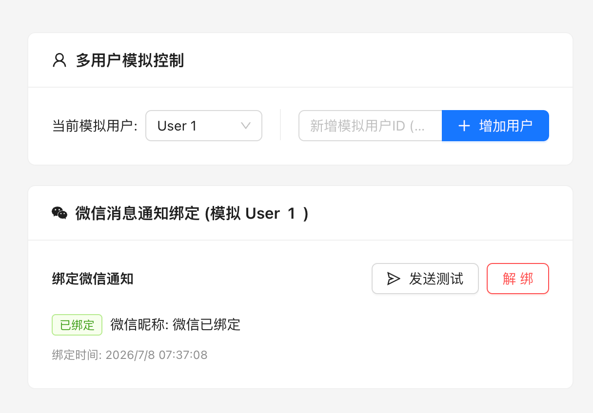

# WeChat Binding & Greeting Confirmation Demo



基于 **FastAPI (Python)** + **React (TypeScript) + Ant Design 5** 实现的微信服务通知绑定/解绑/打招呼激活会话流程最小 Demo。

## 功能特性
1. **多用户绑定机制**: 使用 SQLite 隔离，支持发起绑定、保存凭证、状态查询。
2. **打招呼交互逻辑**:
   - 扫码成功后，Modal 不会自动消失。
   - 二维码替换为成功绿勾，并提示用户在手机端向 AI Bot 对话框发送任意确认消息。
   - 当检测到有消息后（5秒后自动模拟接收），Modal 自动关闭，标记完全成功。
3. **安全拦截提示**: 在用户未发送首条消息时，若点击测试发送，会弹出 Modal 引导对话框，而非抛出粗暴的错误信息。

## 目录结构
- `backend/` : FastAPI 异步接口，使用 SQLite 数据库及 `MockWeChatBot` 自动模拟扫码确认与发消息流程。
- `frontend/` : React + Vite 单页面应用，提供优雅简约的绑定配置交互界面。

## 启动说明

确保您的系统已安装 `python3`、`node` 和 `npm`。

1. 给启动脚本赋予执行权限：
   ```bash
   chmod +x start.sh
   ```

2. 运行脚本：
   ```bash
   ./start.sh
   ```

3. 访问前端开发服务器：
   打开浏览器访问 [http://localhost:3000](http://localhost:3000) 进行体验。
